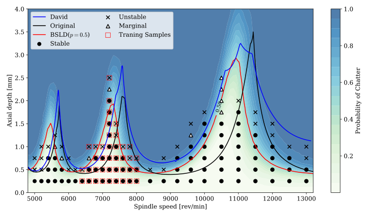

# Bayesian Stability Lobe Diagram(BSLD)

## Introduction

This code is a simplified step-by-step implement for better understanding of the submitted manuscript: **Physics-informed Bayesian Inference for Milling Stability Analysis**.  Please contact cgx@nuaa.edu.cn if there is any mistake or confusion. 

**1**. Due to the randomness of the sampling, the results of each run may be slightly different.
You can run the `step5_final.py` to get the result (Fig. 8. in the manuscript).



**2**. To illustrate the algorithm clearly, the total procedure is separated into the 8 steps.  Run the following steps in sequence to get the data for the intermediate steps and the final result:

1. `step1.1_SampleForAgent.py`    Sampling 800 points from the prior distributions to train the surrogate models of spectral radius.  Sobol sampling strategy is adopted here for efficient space-density sampling. The model parameters  comes from [David](https://www.sciencedirect.com/science/article/pii/S0890695519310995). The spectral radius is calculated by [FDM](www.sciencedirect.com/science/article/pii/S089069551000012X). The default parameters of stability lobe diagram is defined in the function `FDM_function`.
2. `step1.2_SortData.py`  The sampled data is organized from 800 groups of SLDs to 2295 (the grids of SLD is 27*85=2295) groups of spectral radius.
3. `step2_TrainAgentModel.py`  2295 surrogate models are trained using the datasets $[\mathbf{w}, \lambda]$.   The surrogate models are simple multi-layer perceptions in pytorch. 
4. `step3_BSLD.py`  Inferring the posterior distribution using Laplace approximation. The model of the distribution $\mathbf{w}_{*}$ is obtained by maximizing the posterior function using gradient decent in pytorch.  Note that the Hessian matrix is calculated using the auto-grad graph of pytorch. The experimental training data used in this step is `MTM_newCase_partial.csv`.
5. `step4.1_SampleForProbabilisticLobes.py`  Sample 500 points from the posterior distribution. Note that this sample strategy is distribution-density sample rather than space-density sample in step1. This step takes some time because of FDM calculation. The spectral_radius for posterior distribution can also be obtained the trained surrogate models.
6. `step4.2_SortDataForProbabilisticLobes.py` Organise the dataset, the same  as step 2.
7. `step4.3_GetProbabilisticLobeDiagram.py` Calculate the number $N_{\text {chatter }}$ based on the value of spectral radius. 
8. `step5_final.py` Plot the probabilistic SLD using  iso-probability boundaries.

**3**. We also have trained all surrogate models in `GeneratedData\Step2Model` , so you can directly run the `step3_BSLD.py` to  inference the posterior distribution of parameters. 

**4**. The following important packages need to be configured in order to run the code:

```
pytorch 1.6.0
sobol_seq (pip install git+https://github.com/naught101/sobol_seq@v0.2.0#egg=sobol_seq)
```


### Acknowledgement
Here, we also would like to greatly acknowledge the help of Dr.  [David](https://www.sciencedirect.com/science/article/pii/S0890695519310995) for data sharing in the case study. 
